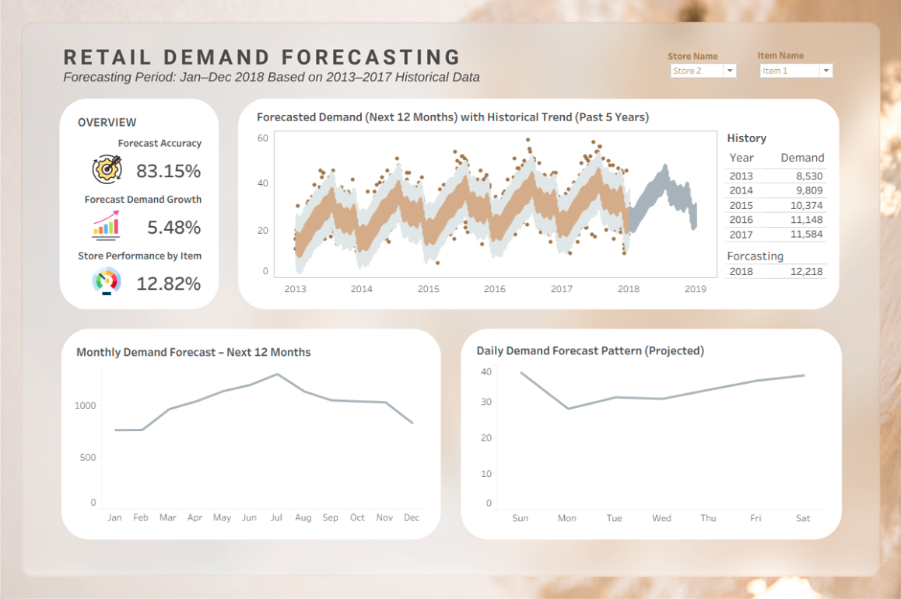
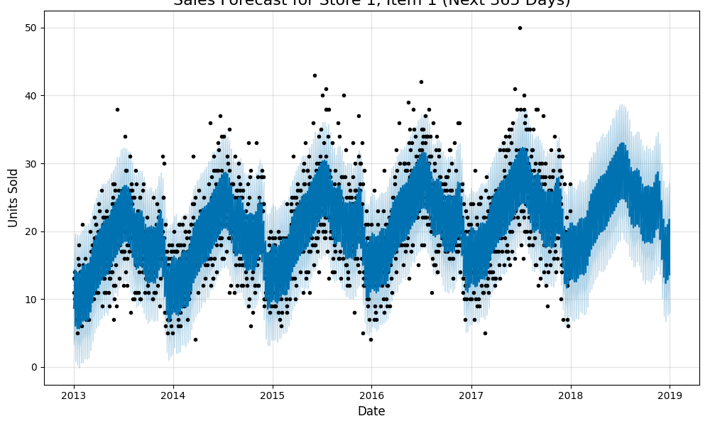

# 🛒 Retail Demand Forecasting using Time Series Analysis

An end to end time series forecasting project to predict retail product demand using Python and the Prophet library. The forecast is visualized in an interactive Tableau dashboard to support business decisions in inventory and supply chain planning.

  
🔗 **[View the Full Interactive Dashboard on Tableau Public](https://public.tableau.com/views/RetailDemandForecastingNext12MonthsBasedon5-YearTrend/Dashboard12?:language=en-GB&:sid=&:redirect=auth&:display_count=n&:origin=viz_share_link)**

---

## 1️⃣ The Business Challenge

A large retail company must predict future demand accurately to avoid two costly issues:

- **Stockouts:** Missed revenue due to insufficient inventory.
- **Overstocking:** Increased cost due to excess unsold inventory.

🎯 **Objective:** Build a robust forecasting model to predict **daily unit sales for the next year** using historical data, enabling data driven decisions.

---

## 2️⃣ The Solution & Key Business Insights

We developed a time series forecasting model using [**Facebook Prophet**](https://facebook.github.io/prophet/), trained on 5 years of historical daily sales data.

### ✅ Key Results:
- **Forecast Accuracy:** 83.15% *(1 - MAPE)*  
- **MAE:** ≈ 3.8 units per day  
- **Demand Growth Forecasted:** 5.48%  
- **Strong Seasonality Patterns:**
  - 📅 **Weekly:** Weekend peaks, Monday dips
  - 📆 **Yearly:** Summer season surge (June-August)

These insights support better inventory control, marketing strategies, and staffing schedules.

📈 Final Forecast Visualization:


---

## 3️⃣ Technical Workflow

1. **Data Preparation**
   - Load 5 years of historical sales (`train.csv`)
   - Convert date columns to datetime
   - Filter to single series (Store 1, Item 1)

2. **Exploratory Data Analysis (EDA)**
   - Trend and seasonality checks
   - Year over year and day of week pattern visualizations

3. **Model Training**
   - Use Prophet to fit model with:
     - Automatically detected **trend**
     - **Weekly** and **yearly** seasonality

4. **Forecasting & Component Analysis**
   - Generate 365 day forecast
   - Plot forecast with confidence intervals
   - Visualize trend, weekly, and yearly components

5. **Model Evaluation**
   - Perform **cross_validation** with Prophet's `performance_metrics`
   - Metrics calculated: MAPE, MAE, RMSE

6. **Export to BI Tool**
   - Export final forecast to `full_sales_forecast.csv`
   - Visualize in **Tableau Public** with:
     - Forecast accuracy
     - Forecast growth
     - Store level performance by item

---

## 🧰 Tech Stack

| Category         | Tools / Libraries                         |
|------------------|--------------------------------------------|
| **Language**     | Python                                     |
| **Libraries**    | pandas, Prophet, matplotlib, seaborn       |
| **Notebook Env** | Jupyter Notebook / Google Colab            |
| **Visualization**| Tableau Public                             |
| **Forecasting**  | Prophet with CmdStanPy backend             |

---

## 📂 Project Structure

```
retail-demand-forecasting/
│
├── notebooks/
│   ├── retail_demand_forecasting.ipynb
│   └── retail_demand_forecasting.py
│
├── data/
│   └── train.csv
│
├── results/
│   ├── full_sales_forecast.csv
│   └── visualizations/
│       ├── forecast_components.png
│       ├── final_forecast.png
│       └── dashboard_preview/
│
└── README.md
